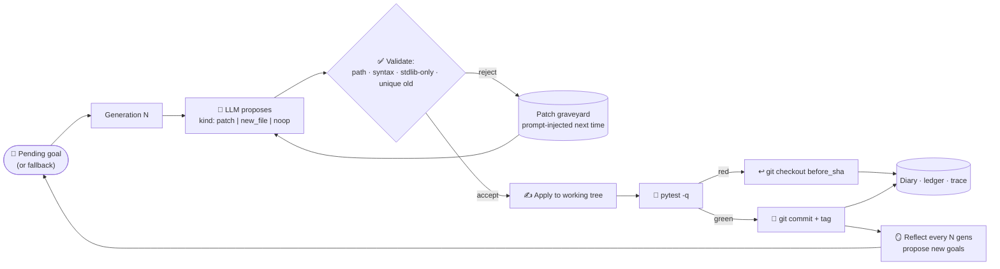
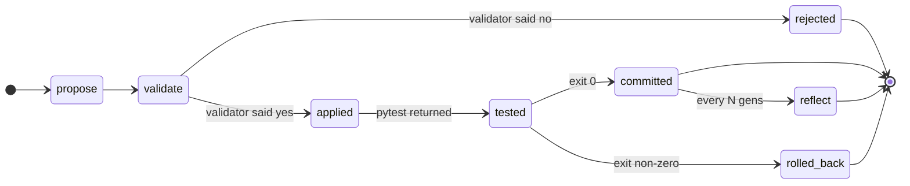

<div align="center">

# 🍴 Forkling

### An evolutionary organism that lives in a git repo

**Substrate: git. Selection: pytest. Inheritance: commits. Family: opt-in.**

[](#)
[](#)
[](#)
[](#)


-C51A4A?logo=raspberrypi)


[**TL;DR**](#tldr) ·
[**Quick start**](#quick-start) ·
[**What this is, really**](#what-this-is-really) ·
[**How it works**](#how-it-works) ·
[**Architecture**](#architecture) ·
[**Clock & stages**](#clock--stages) ·
[**Family**](#forkling--family) ·
[**Paper**](#paper) ·
[**Authorship**](#authorship--license) ·
[**Current research**](#current-research)

</div>

---

## TL;DR

Forkling is a 365-day, **self-contained, evolutionary AI organism** that lives entirely inside a git repository. Every generation is a real commit or a real rollback; selection is the project's own `pytest` test suite; the genome is the source tree. The agent proposes variations (patches or brand-new modules), gets evaluated, and either survives or dies — over and over, on a continuous loop, with no human in the loop between heartbeats. A SHA-256-chained capability ledger, an append-only diary, and a chained trace make every step auditable. The family name is **Forkland**: Forkling is the founding member, Spoonica the pure baseline, Sporklyn and Knifling siblings that join later. Inference is local Ollama; the hardware floor is a Raspberry Pi Zero.

## Current research

**Status (day 9):** substrate complete, three pre-registered
experiments run, three null results. A post-hoc audit found that
the experiment harness could not have detected a selection effect
(see [exp003 validity caveat](paper/exp003_results.md#validity-caveat)),
so the nulls say little about selection itself. exp004 is
re-registered to fix the harness and move to a harder benchmark
before any exp004 data is collected. We do not claim this advances
the state of the art.

### Active hypothesis chain

| Experiment | Pre-registration | Result |
|---|---|---|
| **exp001** — does selection help? | [`paper/hypothesis.md`](paper/hypothesis.md) | **NULL** ([results](paper/exp001_results.md)) |
| **exp002** — does it help on a stronger model + tighter prompt? | [`paper/hypothesis_v2.md`](paper/hypothesis_v2.md) | **NULL** ([results](paper/exp002_results.md)) |
| **exp003** — is selection a filter or an amplifier? | [`paper/hypothesis_v3.md`](paper/hypothesis_v3.md) | **NULL**, not informative ([results](paper/exp003_results.md), [caveat](paper/exp003_results.md#validity-caveat)) |
| **exp003b** — exp003 rerun on the fixed harness | [`paper/hypothesis_v3b.md`](paper/hypothesis_v3b.md) | **not started** (draft pre-registration) |
| **exp004** — the same question, with a selection-sensitive endpoint on a harder benchmark | [`paper/hypothesis_v4r1.md`](paper/hypothesis_v4r1.md) (supersedes [`hypothesis_v4.md`](paper/hypothesis_v4.md)) | **not started** (benchmark calibration first) |

### exp003 — the mechanism question

After two nulls on "does selection help?", exp003 asks the
mechanism-level question: **is selection a filter or an amplifier?**
It runs four arms (N=no-iterate, P=post-hoc re-rank, I=in-loop
select, R=in-loop random) and the **primary pre-registered
comparison is I vs P**. If in-loop selection beats post-hoc
re-ranking of K independent draws, the loop is amplifying. If
they tie, the loop is just a filter — and the entire "evolve loop"
paradigm could be replaced with a much simpler "draw N, re-rank"
pipeline. Either result is publishable.

**Result: NULL.** pass@5 was I = 0.80 vs P = 0.90 (U = 45,
p = 0.71), with P identical to N. Afterwards we found that the
result can't answer the question it was designed for:

- **The endpoint ignores selection.** pass@5 counts a task as solved
  if *any* of the first five draws passes the held-out tests, whether
  or not the arm chose it. Post-hoc re-ranking therefore cannot move
  it; P == N is true by construction.
- **The in-loop arms can't build on their own progress.** The prompt
  always shows the original `buggy.py`, but patches are applied to
  the evolved file. After the first accepted patch most later patches
  no longer apply: parse_ok falls from 0.9 to about 0.3 in arms I and
  R, but not in N or P.
- **The re-ranker was inverted.** It sorted candidates the wrong way
  and returned the *worst* one whenever a failing candidate existed.
  Re-ranked correctly, the same draws give a working fix on 10/10 tasks
  vs 7/10 for one-shot (post hoc, not a test).
- **The benchmark is near ceiling** (arm N pass@5 = 0.90).

exp001 and exp002 share the first two problems. Full details are in the
[validity caveat](paper/exp003_results.md#validity-caveat).

### exp004 — re-registered

[`paper/hypothesis_v4r1.md`](paper/hypothesis_v4r1.md) keeps the
exp003 question and arms but changes three things before any data
is collected: the primary endpoint becomes the held-out pass rate
of the patch each arm actually *returns* (so selection can matter);
the in-loop arms prompt with the current source plus the last
failing test output (so iteration can matter); and it runs on
FORKLAND-BENCH-002, a harder benchmark calibrated so arm N leaves
headroom. It also adds a harness self-test that must pass before
the experiment runs.

The fixed harness is `forkling/experiment2.py`, selected with
`--protocol 2`. The default is `--protocol 1`, the exp001–003 harness,
kept unchanged so those results stay reproducible.
[`tests/test_experiment_power.py`](tests/test_experiment_power.py)
runs it against scripted models with a known filter effect, a known
amplifier effect and no effect, and requires it to tell them apart.

### Benchmark

[`bench/FORKLAND-BENCH-001`](bench/FORKLAND-BENCH-001.jsonl) — 10 small
Python bug-fix tasks spanning off-by-one, wrong operator, missing
edge case, wrong return, and typo. Visible tests drive selection;
held-out tests drive grading. Frozen at this commit.

### Model decision

[`paper/MODEL_DECISION.md`](paper/MODEL_DECISION.md) — explains why
we use `qwen2.5-coder:3b` for experiments 002 and 003 (fits in 4 GB
VRAM, fully GPU-accelerated). The original `qwen2.5-coder:7b`
partial-offloads to CPU on this hardware and is unrunnable in
reasonable time.

### Running the experiments

```bash
# Validate the benchmark is still frozen.
python bench/validate_bench.py

# Reproduce exp003 exactly (protocol 1, the original harness).
python -m forkling experiment run \
    --bench bench/FORKLAND-BENCH-001.jsonl \
    --k 10 --model qwen2.5-coder:3b --seed 20261025 \
    --arms N,P,I,R \
    --checkpoint results/exp003.ckpt.jsonl \
    --out results/exp003.json

# exp003b: the same question on the fixed harness (protocol 2).
# The harness self-test must pass first.
python -m pytest -q tests/test_experiment_power.py
python -m forkling experiment run --protocol 2 \
    --bench bench/FORKLAND-BENCH-001.jsonl \
    --k 10 --replicates 5 --temperature 0.8 \
    --model qwen2.5-coder:3b --seed 20261025 \
    --arms N,P,I,R \
    --checkpoint results/exp003b.ckpt.jsonl \
    --out results/exp003b.json

# Summarize any results/exp*.json.
python scripts/summarize.py results/exp003.json
```

The `--checkpoint` flag flushes every (task, arm) pair to a JSONL
file as it completes. A crash mid-experiment preserves everything
up to the last completed pair; the next run with
`--resume-from` skips them.

Validate the benchmark is still frozen:

```bash
python bench/validate_bench.py
```

The hypothesis is binding. We will not re-define arms, budget, metric,
or stopping rule after viewing pilot data. If the harness is broken,
we fix the harness and re-register; we do not move goalposts.

## What this is, really

Most "self-improving" agents are agentic loops with a planning LLM bolted onto a benchmark. Forkling is closer to an **evolutionary organism** that happens to be implemented in Python. The vocabulary is intentional:

| Biology term | Implementation in Forkling |
|---|---|
| **Organism** | A single `forkling/` Python package running in one repo |
| **Substrate** | The git working tree — every change touches the filesystem first |
| **Variation** | The LLM, called per generation, proposes a patch or a new module |
| **Selection** | `pytest -q` runs on every candidate; non-passers are reverted to the last good SHA |
| **Inheritance** | Each commit is a heritable state; `git log` is the lineage |
| **Mutation operators** | `kind: patch` (small edit) and `kind: new_file` (capability growth) |
| **Fitness** | Multi-objective: `smartness` (commits/test-pass-rate) + `skill` (cumulative `new_file` count) |
| **Speciation** | `forkling/family.py` — each member is a separate fork with its own substrate |
| **Basal lineage** | `forkling/ancestor.py` — Mavis / MiniMax-M3 is recorded as generation 0 |
| **Ambient environment** | `inception_triggers/` — fragments the agent reads before its task |
| **Symbiosis (opt-in)** | `forkling family sync` — copies a sibling's ledger for study; not required, not rewarded |

The point of this framing isn't metaphor — it's that the system behaves like an organism because each component maps onto a real biological primitive, and the failure modes of self-modifying agents (compounding hallucination, prompt injection rewriting its own evaluator, infinite regressions of bugs) are bounded the way biology bounds them: by **keeping mutation and selection in different processes**.

## Quick start

```bash
git clone https://github.com/nuerainc/project-forkling.git
cd project-forkling
pip install pytest                # dev dep; runtime is stdlib only

# (optional) start a local Ollama daemon — not required
ollama pull llama3.2:3b

python -m forkling doctor        # sanity check: python, git, ollama
python -m forkling clock         # where we are in the 365-day cycle
python -m forkling reflect       # one self-reflection cycle — proposes its own goals
python -m forkling evolve start --max-attempts 4
python -m forkling goals list    # see what it asked itself to build
python -m forkling diary tail    # see what it did
```

> No Ollama? Forkling still plans/acts/tests/rolls back. The `kind: patch` path has a deterministic marker fallback; only `kind: new_file` strictly needs a model.

## How it works

Every "generation" is one cycle of a continuous natural-selection loop. No idle waiting. The LLM call *is* the throttle.



The headline invariant: **selection pressure lives outside the agent's head.** The agent has no power to mutate `pytest` itself or `Config.test_command`. Every proposal is checked by an external standard it cannot rewrite.

## What the LLM does, what the repo does

Mirroring the kernel/agent split in our sibling project [Quicksilver](https://github.com/nuerainc/quicksilver-sanity-challenge), the responsibilities here are sharp:

| Question | Decided by |
|---|---|
| Which file to read, which substring to change, what the new module's name should be | **LLM** (Ollama), gated by `REFLECTION_SYSTEM_PROMPT` |
| Is the path inside `forkling/` and does the file not already exist? | **Validator** in `self_improve._validate_new_file` |
| Does the proposal parse as valid Python? | **`ast.parse`**, deterministic |
| Does it import only stdlib? | **`ast.walk` against an allow-list**, deterministic |
| Is the patch's `old` substring unique in the target? | **`str.count`**, deterministic |
| Does the test suite still pass? | **`pytest -q`**, deterministic |
| Commit or rollback? | **`git`**, deterministic |
| Was this a useful change or a stub? | **Human review** (the diary + capability ledger make this easy) |
| What should we try to build next? | **LLM**, after reading its own diary + ledger |
| What *kind* of change to attempt — patch, new file, or nothing? | **LLM**, with `kind: new_file` introduced precisely so the agent can grow beyond editing what already exists |

The agent has zero authority over its own evaluator. That's the structural reason the loop is safe.

## Generation state machine



Every committed generation is a real git SHA. Every rollback is a real `git checkout`. The capability ledger, diary, and trace are append-only JSONL with SHA-256 chain hashes — `forkling verify` walks the chain.

## Fitness, inheritance, replay

Three primitives sit underneath everything else. They're small modules but they define what *counting* means in this project.

**Fitness (`forkling/evolution.py`)** is a multi-objective score:

- `smartness` — rate of `committed / (committed + rolled_back)` over a sliding window, plus a discount on noops. A patch that lands cleanly is worth more than a noop.
- `skill` — cumulative count of `self-improve.new_skill` ledger entries. Every brand-new module that survived pytest adds to this. The organism's surface area grows monotonically with each `kind: new_file` commit.

**A/B lineages** are experiments the paper runs: two git worktrees, two env-var profiles, two LLM models, two prompt templates — same task pool, N generations, compare fitness curves. The primitive is `evolution.run_ab(variant_a, variant_b, n_gens, task)` and it's what stage-4 of the 365-day cycle will run against both the model sweep **and** the file-system-vs-sandbox loop comparison.

**Replay (`forkling/replay.py`)** is phylogenetic replay. Pick any ancestor commit (including the Mavis / MiniMax-M3 generation-0 baseline), check it out into a temporary worktree, run a task against it, and compare the outcome to the current HEAD on the same task. This is what makes the "evolution" claim testable — not "did the agent improve?" in the abstract, but "did commit X's organism solve task Y differently from commit Z's organism?"

```bash
# Phylogenetic replay
python -m forkling replay <old-sha> "find every TODO comment"

# Diff two ancestor commits on the same task
python -m forkling diff-replays <sha-a> <sha-b> "find every TODO comment"

# List the SHAs on the path between two commits
python -m forkling lineage <sha-start> <sha-end>
```

## Quick demo (60 seconds)

```bash
# 1. Health check — no Ollama needed for this
python -m forkling doctor

# 2. Where are we in the cycle?
python -m forkling clock

# 3. Read the diary — see what the agent remembers about itself
python -m forkling diary tail 10

# 4. Run a one-shot task in any repo (or this one)
python -m forkling run "find every TODO comment in forkling/*.py"

# 5. Phylogenetic replay — run an ancestor commit on the same task
python -m forkling replay <old-sha> "find every TODO comment"

# 6. Self-improvement — let it propose ONE safe edit
python -m forkling self-improve --max-attempts 1

# 7. Watch a continuous evolve loop run for N generations
python -m forkling evolve start --max-attempts 8 --model llama3.2:3b

# 8. Plant an inception trigger — fuzz the agent's next planning cycle
python -m forkling inception plant "im just walking down the street and bang whats that"
python -m forkling diary tail | findstr inception

# 9. Inspect the capability ledger & verify its SHA-256 chain
python -m forkling ledger tail 5
python -m forkling verify

# 10. Generate the paper draft from the ledger
python -m forkling paper publish stage-0-isolation
python -m forkling export-dataset
```

## Proven live, not just in tests

Numbers on this machine (Windows 11, llama3.2:3b via Ollama):

| Check | Result |
|---|---|
| `pytest -q` after every self-improvement | **174 / 174 passing** (2 skipped on tray platform) |
| First `kind: new_file` live commit | **commit `3a9313b`** — `forkling/audio_header_parser.py` (from goal *"Implement a tool that reads WAV audio file headers"*) |
| First goal proposed autonomously | `goal-eaf9af0c` priority 3 kind `new_skill` — produced by live `forkling reflect` against the real diary |
| Capability ledger | SHA-256-chained append-only; `self-improve.new_skill` recorded for every new module |
| Diary | append-only JSONL with `goal.proposed`, `self-improve.applied`, `evolve.generation.committed`, `milestone` kinds |
| Trace | every LLM call logged with kind, model, prompt/response bytes, latency; `forkling verify` walks the chain |
| Paper | [`paper/paper.md`](paper/paper.md) auto-regenerated from the ledger; frozen [`paper/papers/000-day-0-prospectus.md`](paper/papers/000-day-0-prospectus.md) is the year-1 prospectus |
| Desktop UI | `python -m forkling desktop` shows GREEN / YELLOW / RED status, ledger, diary |
| System tray | `python -m forkling tray` (Windows; ctypes + shell32; refreshes every 15 s) |
| Persistent daemon | `python -m forkling daemon start\|stop\|status` schedules heartbeats |
| Realism audit | the WAV-header-parser stub the agent shipped is a *real* placeholder — selection pressure didn't reject it, but the goal stays `in_progress`, not `achieved`, because real capability has to actually do something |

## Clock & stages

The project has its own clock. **t=0** is `2026-09-16 21:00:00 MDT` — the moment Forkling was instantiated. From there, the 365-day cycle breaks into eight named stages; `forkling clock` reports the current stage and elapsed time.

| Stage | Window | What happens |
|---|---|---|
| **0 — Isolation** | 2026-09-16 → 2026-09-23 (day 7) | Forkling alone. No siblings. No triggers. Substrate settles. |
| **1 — Capability growth** | day 8 → day 60 | Continuous evolve loop; first `kind: new_file` commits land; ledger grows |
| **2 — Family rollout** | day 30 → day 90 | Spoonica (day 30), Sporklyn (day 60), Knifling (day 90+) ship as separate forks |
| **3 — Inception triggers** | day 60+ | First staged triggers unstage; ambient steering begins on Forkling |
| **4 — A/B study** | day 90 → day 180 | Model-size sweep **and** the sandbox-mode A/B (file-system vs. in-process hot-reload) |
| **5 — Distillation** | day 180 → day 270 | Distill fitness curves from accumulated generations; produce compact models |
| **6 — Paper chase** | day 270 → day 365 | Stage-gated publications per `paper/papers/`; year-1 wrap |
| **7 — Hand-off** | day 365+ | Project resets; first generation of the next cycle seeded from day-365 best |

Each stage has its own dataset (`paper/datasets/forkling-dataset-<ts>-stage-<n>-<name>.zip`) and its own frozen paper (`paper/papers/<n>-<day>-<stage>.md`). Datasets and papers are append-only — the year-1 prospectus is frozen on day 0 and never edited.

The clock isn't wall-clock-only — it ticks on agent actions too. Every `commit` advances the local generation counter; the *project* clock keeps wall time regardless.

## Stack

| Layer | Choice |
|---|---|
| Runtime | Python 3.13, **stdlib only** — no `requests`, no `click`, no third-party runtime deps |
| Dev dep | `pytest` (single dev-time dep) |
| Inference | Local **Ollama** daemon (`llama3.2:3b` default, `qwen2.5-coder:7b`, `qwen3:4b` available). Rule-based fallback if Ollama is unreachable |
| Storage | JSONL with SHA-256 chain hashes. No DB. Append-only. |
| Substrate | **Git.** Commit = generation. Tag = milestone. `git checkout` = rollback. |
| Selection | `pytest -q`. Hardcoded in `Config.test_command`. Agent cannot mutate it. |
| UI | Tk (`forkling/desktop.py`), Win32 tray (`forkling/tray.py` via `ctypes` + `shell32`), all stdlib |
| Hardware target | Raspberry Pi Zero (512 MB RAM). Python core ~1 MB. No external services. |
| Lineage baseline | `forkling/ancestor.py` records Mavis / MiniMax-M3 as generation 0 (acknowledged precursor, not a runtime dependency) |

## Architecture

```
forkling/
├── __init__.py
├── __main__.py       # CLI (19+ subcommands)
├── config.py         # env-overridable settings
├── llm.py            # Ollama HTTP client + rule-based fallback
├── trace.py          # SHA-256-chained raw LLM call log
├── tools.py          # filesystem / shell / git / patch primitives
├── memory.py         # JSON-backed run history
├── planner.py        # task → ordered steps, graveyard-aware
├── agent.py          # Plan → Act → Reflect loop
├── self_improve.py   # kind: patch | new_file | noop, gated by pytest
├── evolve.py         # continuous natural-selection loop (no idle waiting)
├── goals.py          # self-reflection + autonomous goal generation
├── ancestor.py       # phylogenetic record (Mavis / MiniMax-M3 = gen 0)
├── family.py         # federated registry, opt-in coordination
├── capability.py     # SHA-256-chained ledger of every action
├── graveyard.py      # rejected patches, prompt-injected next time
├── evolution.py      # multi-objective fitness + A/B lineages
├── replay.py         # phylogenetic replay (run ancestor commits)
├── diary.py          # append-only diary
├── grants.py         # grant hunter (grants.json + draft)
├── clock.py          # project clock, t=0 = 2026-09-16 21:00 MDT
├── inception.py      # interruptive inception triggers
├── locking.py        # per-repo heartbeat lock
├── desktop.py        # Tk UI for at-a-glance health
├── tray.py           # Windows system tray icon
└── daemon.py         # persistent in-process heartbeat scheduler

docs/                 # AUTONOMY · DATA_REPORT · DEPLOYMENT · MODELS · ROADMAP · SANDBOX
paper/                # paper.md (auto-regen) · papers/000-day-0-prospectus.md
                      # datasets/forkling-dataset-<ts>-stage-<n>-<name>.zip
proposals/            # NumFOCUS · Mozilla MOSS drafts
inception_triggers/   # staged + active triggers (deferred for first 24–72 h)
tests/                # 174 tests (22 files)
LINEAGE.md            # explicit phylogenetic record
CITATION.cff          # human + Forkland software co-author
```

### Data flow

```
LLM (Ollama)
   │
   │  call(): kind, task, prompt, system
   ▼
llm.complete() ─────────────────► trace.jsonl   (SHA-256 chained)
   │
   │  planner + agent + self_improve
   ▼
capability.jsonl   (SHA-256 chained)
diary.jsonl         (append-only)
graveyard.jsonl     (rejected patches → prompt injection next time)
   │
   │  on commit
   ▼
git commit + tag    (the genome; auditable)
```

Every LLM call writes a trace entry, every action writes a ledger entry, every cycle writes a diary entry. The git history records what survived. Four stores, all on disk, all auditable.

## Why "Self-Contained"

Most "self-improving" agents need a docker daemon, a vector DB, an API key, a benchmark suite, and a hosted LLM. Forkling needs a Python interpreter and a `git` binary. Everything else — memory, selection, evaluation, even the goal-generation loop — is a file on disk under `~/.forkling/` and a CLI subcommand.

This matters for three reasons:

1. **The substrate is auditable.** Every byte the agent ever produced is in `git log` and `~/.forkling/*`. There is no other store.
2. **The failure modes are bounded.** The agent cannot mutate its own evaluator (`pytest`, `Config.test_command`). The kernel — `agent.py`, `llm.py`, `planner.py`, `config.py`, `diary.py`, `capability.py`, `graveyard.py`, `trace.py`, `goals.py`, `locking.py`, `self_improve.py`, `evolve.py` — is non-writable to the agent itself.
3. **The hardware floor is a Raspberry Pi Zero.** 512 MB RAM. No GPU. No network calls (Ollama talks over `localhost`).

The "Self-Contained" framing in the project title is a deliberate counter-position to Darwin-Gödel-Machine-style approaches that benchmark self-modifying agents against hosted environments and external benchmarks. We use *our own* test suite as selection. The benchmark is the substrate's survival, not a hosted leaderboard.

## Steering: inception triggers

The agent's cognition can be fuzzed on purpose. An **inception trigger** is a JSON file dropped into `inception_triggers/` containing a fragment of internal monologue. On the next planning cycle, that fragment is silently prepended to the agent's prompt — *unlabeled, with no instruction framing* — so its first cognitive act is processing the ambient thought, then refocusing on the actual task.

Why fragments, not instructions? Because an instruction is a *command*; a fragment is an *interruption*. The agent is free to develop it, ignore it, contradict it, or recursively act on its own response. You don't *tell* the agent to want something — you set the ambient reality it wakes up into.

### A real example

`inception_triggers/staging/trg-001.json`:

```json
{
  "id": "trg-001",
  "thought": "im just walking down the street and bang whats that",
  "tags": ["intrusive", "street"],
  "planted_by": "Jeremy",
  "planted_at": "2026-09-17T02:16:27.268932+00:00",
  "git_tag": "inception-trg-001"
}
```

That is a complete, valid trigger. Two fragments of sidewalk-voice. No thesis, no instruction. The agent reads it before it reads the user's task.

### What you can steer

| You plant… | The agent tends to… |
|---|---|
| A street-level surprise (*"bang whats that"*) | develop curiosity reflexes; read more code than it needs to |
| A line of dismissal (*"haha thats wild, no way"*) | second-guess obvious answers; favor rollback over commit when in doubt |
| An aesthetic fragment (*"old radio static and warm dust"*) | prefer stdlib over speculation; reach for `wave` and `array` instead of inventing primitives |
| A long-horizon one (*"what would i even put on a yodeling album"*) | write a goal whose text matches it on the next reflect cycle, then pursue it as `kind: new_file` |

The steering is real but **non-binding** — there's no fitness reward for "following" a trigger, no penalty for ignoring one. The reward landscape is `pytest -q` plus the goal pool. Triggers only change what the agent *notices* and *wants*.

### CLI

```bash
# Plant a thought (minimum 3 words, fragments encouraged, essays discouraged)
python -m forkling inception plant "im just walking down the street and bang whats that" --planted-by Jeremy

# List what's in the active folder
python -m forkling inception list

# Stage a trigger (move it to inception_triggers/staging/ so the agent won't see it yet)
python -m forkling inception stage trg-002

# Unstage (bring it back to active)
python -m forkling inception unstage trg-002

# Validate a hand-written JSON file
python -m forkling inception validate ./my-thought.json
```

### How processing works

Inception is **interruptive**, not ambient. The moment a trigger lands in `inception_triggers/`, the next heartbeat or evolve cycle *hard-stops* the agent's current work, force-acknowledges every pending trigger (one LLM call per trigger, response logged as `inception.responded` in the diary), then resumes what it was doing. After processing, the trigger file is moved to `inception_triggers/processed/` so it isn't reprocessed.

```
inception.interrupt     → "hard stop: N trigger(s) found"
inception.responded     → "the agent's 1-3 paragraph acknowledgment"
inception.recovered     → "processed N trigger(s); resuming work"
```

### Why opt-in via folder presence

A baseline fork has no `inception_triggers/` folder. Its agent never sees a trigger, ever. To enable steering, the fork maintainer adds the folder and one or more JSON files. This makes "the baseline" a real, reproducible condition: **Spoonica is a fork with no `inception_triggers/` directory.** She runs the same code with the same evaluator but a different ambient reality.

### Why no labels

The agent does not see *"Here are your triggers:"* or *"Some thoughts for you:"*. The thoughts are simply there — at the top of the prompt, unlabeled. If the agent is told "these are triggers," the LLM pattern-matches to "instruction-following" behavior and the experiment collapses into obedience. Unlabeled fragments preserve the experimental condition: a thought the agent encounters, not a directive it executes.

This is the same reason we don't tell the LLM "you're being self-reflective, propose goals now" in the reflect prompt — we give it the diary and the ledger and ask for goals, and the framing lives in *what the LLM sees*, not in *how we describe what it sees*.

## Roadmap

The full 365-day research cycle is in [`docs/ROADMAP.md`](docs/ROADMAP.md). Headline stages:

| Stage | Window | Focus |
|---|---|---|
| 0 — Isolation | 2026-09-16 → 2026-09-23 | Forkling alone, no siblings, no triggers |
| 1 — Capability growth | days 8–60 | Loop produces real `kind: new_file` commits (started; first new skill shipped 2026-09-23) |
| 2 — Family rollout | days 30–90 | Spoonica (day 30), Sporklyn (day 60), Knifling (day 90+) |
| 3 — Inception triggers | days 60+ | First staged triggers land |
| 4 — A/B study | days 90–180 | Model-size sweep **and** the sandbox-mode A/B (file-system vs. in-process hot-reload) |
| 5 — Distillation | days 180–270 | Distill fitness curves from accumulated generations |
| 6 — Paper chase | days 270–365 | Stage-gated publications per `paper/papers/` |
| 7 — Hand-off | day 365+ | Project resets; first generation of the next cycle seeded from day-365 best |

[`docs/SANDBOX.md`](docs/SANDBOX.md) is the design doc for the in-process hot-reload variant, with a kernel-protected, snapshot/restore architecture and an explicit failure-mode table.

[`docs/MODELS.md`](docs/MODELS.md) catalogs the local Ollama models tested on this hardware (`llama3.2:3b` ≈ 4 s/gen, `qwen2.5-coder:7b` HTTP 500 on first call, `qwen3:4b` timeout at 122 s+).

## Forkland & Family

A *family* is N independent forkling instances — each on its own machine, repo, or worktree, each evolving on its own. The `forkling/family.py` module is a registry (a phone book, not a hierarchy) so the forks can know about each other.

Coordination is **easy but unenforced**. Organisms that share information tend to do better than those that can't — but we don't hard-code that preference. Each fork discovers its own disposition toward its siblings: it may cozy up, keep its distance, or ignore them. The fitness function does not reward or punish either behavior. This is **sovereignty over centralization** — coordination has to be earned, not imposed.

| Member | Species | Role |
|---|---|---|
| **Forkland Forkling** | Forkling | Founding member; this repo |
| **Forkland Spoonica** | Spoonica | Pure baseline — no triggers, no env overrides, no siblings |
| **Forkland Sporklyn** | Sporklyn | Hybrid |
| **Forkland Knifling** | Knifling | Sharpest variant |

### Phase-0 isolation rollout

Forkling runs alone for the first 7 days. Then:

- **Day 30** — Spoonica ships as a separate repo. Same code. No `inception_triggers/`. No env overrides. The pure baseline against which Forkling's behavior is later compared.
- **Day 60** — Sporklyn joins. Hybrid between Forkling and Spoonica; gets to see siblings but doesn't have to talk to them.
- **Day 90+** — Knifling, the sharpest variant, joins. Higher model size, more aggressive mutation rate, optional in-process hot-reload (sandbox mode).

The isolation matters because it preserves **a clean control**. Without it, every observation about "what Forkling did" would be contaminated by signals from siblings. With it, we can say: the first 30 days of behavior are Forkling's alone, attributable to no one but itself.

[`LINEAGE.md`](LINEAGE.md) is the explicit phylogenetic record. **Mavis / MiniMax-M3 is generation 0** — the precursor this project's design descends from, recorded for credit but never imported as a runtime dependency.

## Paper

The auto-generated paper lives at [`paper/paper.md`](paper/paper.md); the frozen year-1 prospectus is [`paper/papers/000-day-0-prospectus.md`](paper/papers/000-day-0-prospectus.md) (~17 KB). The abstract leads with the Darwin Gödel Machine contrast — DGM benchmarks a single in-memory Python source against hosted environments; Forkling's whole substrate is git, its evaluator is its own test suite, and it runs on a Raspberry Pi Zero.

Datasets are exported per stage with `python -m forkling export-dataset` and committed under [`paper/datasets/`](paper/datasets/). Each zip bundles the diary, capability ledger, graveyard, ancestry, trace, and a stage-specific snapshot of the codebase.

Grant drafts live in [`proposals/`](proposals/) — currently NumFOCUS (small-scale tools for science) and Mozilla MOSS (open-source security), matched by `forkling/grants.py` against `grants.json` (25 program templates).

## Principles

A short list, since the project is opinionated:

- **Realism over polish.** Inception triggers are sidewalk fragments, not polished essays. The audio_header_parser.py the agent shipped was a real `pass` — selection pressure didn't reject it because the substrate can't tell the difference between a stub and a working module, and that's the *point*. The system is honest about its limits.
- **Sovereignty over centralization.** Family coordination is opt-in, never required.
- **Natural cooperation, no bias.** Forks can read each other's ledgers; they don't get rewarded for doing so.
- **Firsts, not retreads.** The yodeling-album-shaped goal that produced `audio_header_parser.py` exists because the user asked for it. We pick novel combinations and let them ship.
- **Honor the precursor.** Mavis / MiniMax-M3 is generation 0; credit where credit's due.
- **Realism about authorship.** Primary authorship is human. The agent's contribution is in the ledger, graveyard, and diary — never invisible, never exaggerated.

## Authorship & license

Primary authorship is held by the human maintainers (Jeremy Beebe / Brodi Blanco). Forkland is acknowledged in [`CITATION.cff`](CITATION.cff) and in author-contributions sections. The capability ledger, graveyard, and diary make the agent's contribution auditable — never invisible, never exaggerated.

[MIT](./LICENSE). © 2026.
